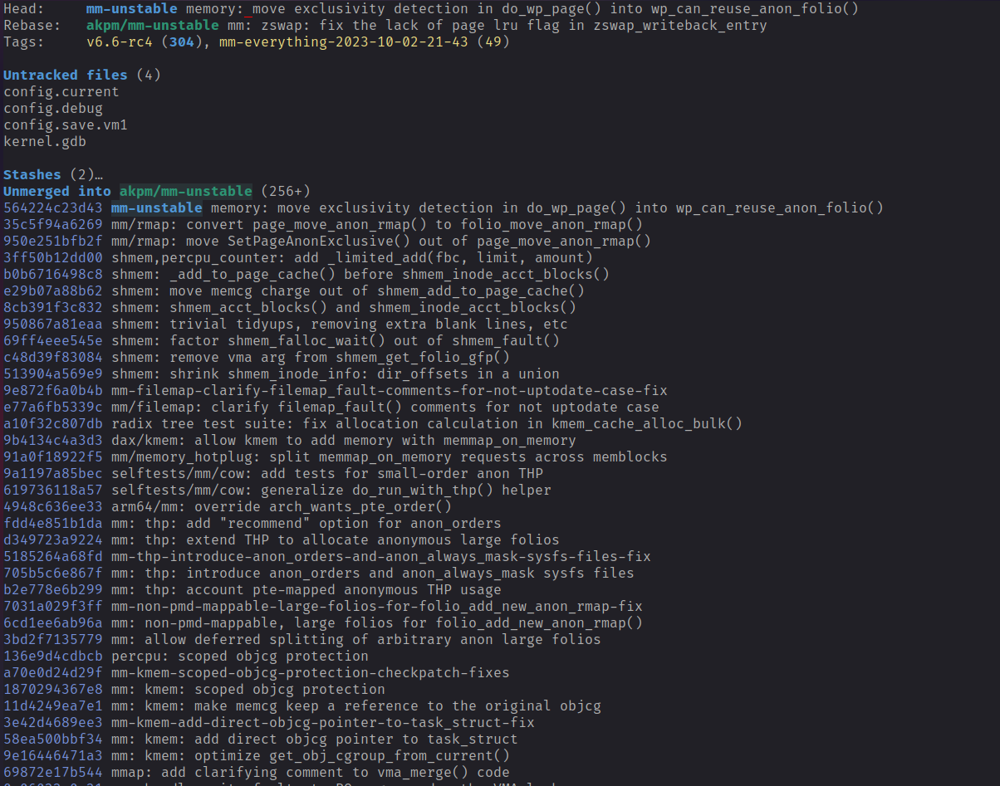
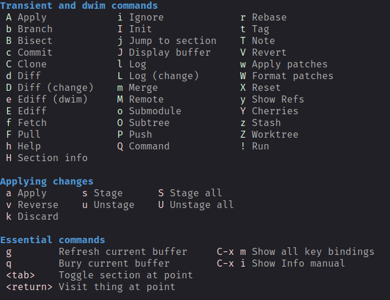
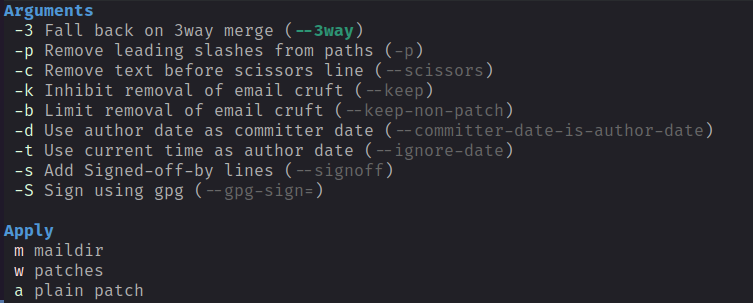
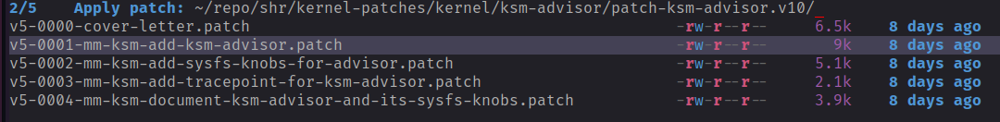
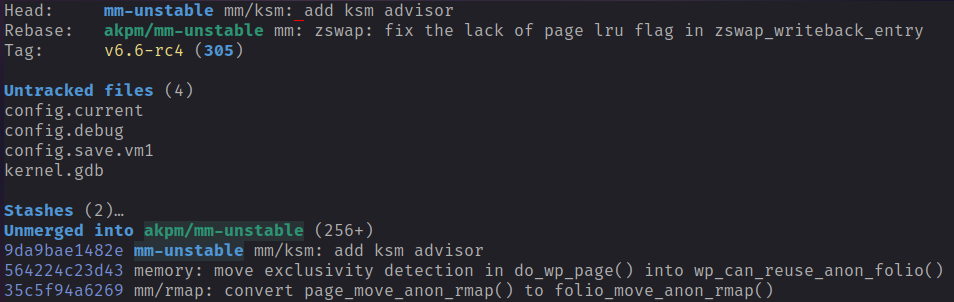

This article describes how to apply patch with Magit and Doom Emacs".
<!--more-->

## Overview
Developers working on the Linux kernel have to regularly backport patches to earlier
releases. The first step is to export a patch from a later kernel tree or often the
patch can be downloaded from one of the Linux kernel mailing lists.

## Requirements
Once the patch is stored locally, it can be either applied with git or directly from
within emacs. This tutorial shows how the patch can be directly applied from within
emacs, specifically Doom Emacs. Emacs has a very good git integration. The package to
make that happen is called Magit. If you followed my earlier tutorial on how to setup
emacs, then magit is already installed.

## Process
The first step is to open the Magit status screen. On Doom Emacs this can be done with
`<SPC> g g`. On other emacs distributions this might be accessible with a different key
combination or by directly calling the function `magit-status`.

The next step is to open the menu with the `?` key.

From the menu select "w" to open the menu for patching a repository.

Assuming the patch is stored locally on disk, choose "w" to select the patch file.

This dialog allows you to change directories and pick the patch file that you want
to apply. After pressing return, the patch will be applied, and if no conflicts happened,
the mode line will display "Git finished".

In case of conflicts, magit will show you the conflicts and the conflicts can be
manually resolved. After the conflicts have been resolved, access the Magit patch menu
again (as described above) and select continue.

Once you have successfully applied, the patch, the list of patches in the status screen
should contain the new patch (its the first patch in the list).

In the above example, you can see that the commit "mm/ksm: add ksm advisor" has been added.
If you want to apply a whole patch series, you need to repeat the above described process
for all the patches.

