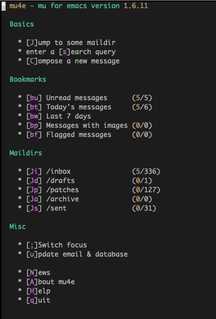

This article describes a possible email setup for your kernel development
environment.
<!--more-->

## Email based development process
The Linux kernel development process is based on emails. Once you have a crafted
a patch or a patch series, you sent an email upstream for review. Generally new
patches are sent with [git send-email](https://git-scm.com/docs/git-send-email).
The patches need to be sent as inline text in the body and should have a content
type of text/plain. The email requirements are discussed in the
[kernel doc](https://docs.kernel.org/process/email-clients.html?highlight=editor+configuration).

### Install packages for email retrieval and email sending
The first step is to install the required Linux packages. To download the emails
different programs can be used. This guide uses the [mbsync](https://isync.sourceforge.io/)
package. To send emails it uses the [msmtp](https://marlam.de/msmtp/) package.
Both packages need to store the password. To avoid storing the password in plain
text, they use the [gpg](https://gnupg.org/) program.

``` shell
sudo pacman -S msmtp
sudo pacman -S isync
sudo pacman -S gnupg
```

### Configure email settings in git
Add the following setings to your git configuration. Replace firstname and lastname
with your name. Make sure to use your real name, so that the patches can be
accepted upstream. Make sure you specify your email address correctly. This specifies
nvim as the default editor, other settings are certainly possible.

``` shell
git config --add user.name "Firstname Lastname"
git config --add user.email "your-accoutn@your-domain"
git config --add core.editor "nvim"

git config --add sendemail.from "Firstname Lastname <your-account@your-domain>"
git config --add sendemail.smtpserver /usr/bin/msmtp
git config --add sendemail.signedoffcc false
git config --add sendemail.suppresscc self
git config --add sendemail.suppressfrom true
git config --add sendemail.chainreplyto false
```

The git configuration is stored in ~/.gitconfig.

### Storing your password
First store your password in a text file like below:
``` shell
echo "my-password" > mbsync.pw
```

Encrypt the password with the following steps:
``` shell
gpg --full-generate-key
gpg --encrypt --recipient "your-account@your-domain" mbsync.pw
mv mbsync.pw.gpg .mbsync-pw.gpg
```

Afterwards the unencrypted password file mbsync.pw can be deleted. Only the
encoded password is stored in the file ~/.mbsync-pw.gpg. 

### Create the mail directory
The mbsync program downloads the emails into a directory. By default the
directory is called Maildir. Let's create that directory.

``` shell
mkdir Maildir
```

### Configure mbsync
The mbsync program is used to retrieve emails. Its default configuration file is
stored under ~/.mbsyncrc. This configuration uses the email service fastmail.
Other email services like gmail can be used. However it is important to pick
an email service provider that doesn't change (re-format) the content of the
body of the email message.

In the below configuration file the Host and User has to be specified. Not all email
services need a CertificateFile. In case your emaiil service doesn't need one,
simply remove the corresponding line. The example below is only a simple
configuration. The mbsync program also supports setting up configurations with
multiple accounts.

``` shell
IMAPAccount fastmail
Host imap.fastmail.com
Port 993
User your-account@your-domain
PassCmd "gpg -q --for-your-eyes-only --no-tty -d ~/.mbsync-pw.gpg"
SSLType IMAPS
CertificateFile /home/stefan/fm.crt

IMAPStore fastmail-remote
Account fastmail

MaildirStore fastmail-local
Path ~/Maildir/
Inbox ~/Maildir/Inbox
SubFolders Verbatim

Channel fastmail
Far :fastmail-remote:
Near :fastmail-local:
Patterns *
Expunge None
CopyArrivalDate yes
Sync All
Create Near
SyncState *
```
In case your email service provider requires a certificate file, the file
can be created with the following command:
``` shell
openssl s_client -connect imap.fastmail.com:993 -showcerts 2>&1 < /dev/null > fm.crt
```
Of course this assumes, that the fastmail email service is used. For other email
services the domain name needs to be adapted accordingly.

At this point we are able to retrieve the messages with:
``` shell
mbsync -a
```
The first time this is executed it will take longer as it will download all the
emails. Future invocations will be faster and only download the new emails.

### Configure msmtp
Mails are sent with the msmptp program. It is configured by default with the
~/.msmtprc configuration file.
``` shell
account default
host smtp.fastmail.com
port 587
from your-account@your-domain
auth login
user your-account@your-domain
passwordeval "gpg -q --for-your-eyes-only --no-tty -d ~/.mbsync-pw.gpg"
tls on
tls_certcheck off
tls_starttls on
logfile ~/.msmtp.log
```
In the above examples the values host and from need to be changed to the valid
values for your email service provider. At this point you are able to send and
retrieve emails.

### Sending and retrieving emails when behind a proxy
In a lot of enterprise environments you don't have a direct connection to the
internet. Instead you are behind a firewall / proxy. If you are not behind a
proxy, continue with "Discussing review comments". In case you are behind
a proxy, the [socat program](http://www.dest-unreach.org/socat/) can be used. When using the
socat program the mbsync and msmtprc configuration needs to be changed. The
socat program is used to tunnel the mail retrieval as well as the mail sending.

The following script can be used for this:
``` shell
#!/bin/bash

socat TCP-LISTEN:13776,fork PROXY:myproxy:smtp.fastmail.com:587,proxyport=8080 &
socat TCP6-LISTEN:13777,fork PROXY:myproxy:imap.fastmail.com:993,proxyport=8080 &
```
In the above script I used the smtp and imap hostnames for the fastmail service.
This needs to be changed for your email service provider. It maps thesee services
to the ports 13776 amd 13777. In your configuration you need to change these ports if they
are already used for exisiting services.

For the .mbsyncrc file the following changes need to be made:
``` shell
Host localhost
Port 13777
```
This retrieves the emails through port 13777 on the local host. The request gets
then proxied to imap.fastmail.com in the above case.

For the .msmtprc file the following changes need to be made:
``` shell
host 127.0.0.1
port 13776
```

## Testing sending of patches
The easiest way to test that everything works is to create a small patch and
send it to yourself or a colleague. The following is a potential workflow (assuming
you are in your base linux kernel directory):
``` shell
emacs mm/ksm.c
  add a comment and save the file
git commit -m "Some comment change"
git format-patch -1
```
The last command creates a patch file (file extension .patch) in your
current directory. You can use this file to send yourself a patch with
a command like the following:
``` shell
git send-email -to your-account@your-domain name-of-the-patch-file
```

## Formatting the patches
The [git format-patch](https://git-scm.com/docs/git-format-patch) command allows
to create patch files for more than one patch. Here is a typical command.
``` shell
git format-patch --base=auto -v 1 -3  --cover-letter -o /some-dir/patch-xyz HEAD
```
It is good practive to specify the base=auto flag. So reviewers can see it is
based on which commmit. The -v flag specifies the version of the patch. For the
first version of the the patch the flag is not needed. However when updating
the patch, the version needs to be specified. The -3 specifies that the top 3
commits should be part of the patch series and a patch file will be created for
each commit. The --cover-letter flag is necessary to also create a cover letter
template file. This template file needs to be edited before sending out the patch.

## Recipients of patches
To determine to whom to send the patches, the get_maintainer.pl script can be
used. Its generally sufficient to the mailing list and the key maintainers.


A known problem is that if the recipient list is too long it can happen that
the mailing list drop the email. Keep this in mind when sending out patches.


## Sending patches and patch series
If you want to send a copy to other recipients or mailing lists they can be
added with the -cc switch. More than one -cc switch can be specified.

Patch series contain more than one patch. Instead of a patch file, it specifies
a patch directory. Patch series require a so-called cover letter. The cover
letter can be specified with --to-cover switch. The cover letter is free form
and describes the change.

Here is a typical command:
``` shell
git send-email --to-cover -to io-uring@vger.kernel.org \
   -cc your-accout@your-domain /some-dir/patch-dir
```

## Installing an email client
To discuss review comments email clients are used. It is important that email 
clients are used that don't change the email content. Not all email clients can
be used for replying to review comments or to reply to the kernel mailing lists.
[This document](https://docs.kernel.org/process/email-clients.html?highlight=editor+configuration) describes which email clients can be used and how they need to be configured.

The next sections describes how to configure the mu email client. Why mu?
mu automatically indexes the emails and provides some advanced capabilities
to search for emails. In addition there is also a very nice integration for emacs
which is called mu4e. The advantage is that code can easily be copied from an editor
window to an email message. Also the mu4e package provides vim keybindings.

### Installing mu
For some Linux distributions mu packages are available. For arch this is not the
case and mu needs to be downloaded and built. To be able to build mu the following
packages need to be installed:
``` shell
sudo pacman -S meson
sudo pacman -S gmime3
sudo pacman -S xapian-core
```
The next step is to clone the mu repository, build mu and install it.
``` shell
git clone https://github.com/djcb/mu.git
cd mu
./autogen.sh
make
make install
```
The [website](https://github.com/djcb) also contains the documentation for the
mu package.

### Index the mail directory
To use mu, mu needs to index the emails and the user needs to specify the directory
where the emails are stored.
``` shell
mu init --maildir=/home/stefan/Maildir --my-address=your-account@your-domain
mu index
```

### Configure emacs
The following sections describe the changes to the emacs configuration. Keep in mind
that when you use a different email service provider some changes are necessary.

#### Change init.el file
To be able to use the mu4e emacs integration, the package needs to be first
enabled in the list of packages in init.el
``` elisp
       :email
       ;;(mu4e +org +gmail)
       mu4e
       ;;notmuch
       ;;(wanderlust +gmail)
```
The corresponding section in the file init.el should look like the above
snippet. The easiest way to open the file is to press `space-f-p` and select
the file init.el. The same key combination can also be used for config.el
and packages.el.

#### Change packages.el file
In the file packages.el add the following line, so that the package can be
found (it was manually installed in the previous step). It also loads the
pinentry package so it can read the encrypted password.
``` elisp
(package! pinentry)
(add-to-list 'load-path "/usr/local/share/emacs/site-lisp/mu4e")
```
#### Change config.el file
Finally configure the package in the file config.el. It firsts starts the
pinentry program to be able to read the encrypted password and enables the
gpg agent with ssh support. Then it configures how to send the email, and
the key folders. The list of folders can easily be changed and extended
as needed.
``` elisp
;; Enable loopback so that pinentry will pop up in emacs
(pinentry-start)

;; Start GPG agent with SSH support
(shell-command "gpg-connect-agent /bye")

;; Set sendmail properties and use msmtp.
;;
(setq sendmail-program "/usr/bin/msmtp"
      send-mail-function 'smtpmail-send-it
      message-sendmail-f-is-evil t
      message-sendmail-extra-arguments '("--read-envelope-from")
      message-send-mail-function 'message-send-mail-with-sendmail)
(setq smtpmail-smtp-server "smtp.fastmail.us)
(setq smtpmail-smtp-service 587)


;; Set sendmail shortcuts for different folders.
;;
(setq mu4e-maildir-shortcuts
  '( (:maildir "/inbox"     :key  ?i)
     (:maildir "/drafts"    :key  ?d)
     (:maildir "/patches"   :key  ?p)
     (:maildir "/archive"   :key  ?a)
     (:maildir "/sent"      :key  ?s)))

;; Map different email folders.
;;
(set-email-account! "your-account"
  '((mu4e-sent-folder       . "/Sent")
    (mu4e-drafts-folder     . "/Drafts")
    (mu4e-trash-folder      . "/Trash")
    (mu4e-refile-folder     . "/Archive")
    (smtpmail-smtp-user     . "your-account@your-domain"))
  t)
```
In case you are behind a proxy, the settings for smtpmail-smtp-server and
smtp-mail-smtp-service need to be changed accordingly.

Update the emacs configuration with:
``` shell
doom sync
```

#### Add help screen for keybindings
This step is optional and is not required. When the hydra key `.` is pressed, it will
display the key bindings at the bottom of the screen. This can be helpful as mu4e
supports a lot of different commands and makes using the package easier.
``` elisp
(defhydra hydra-mu4e-main (:color blue :hint nil)
  "
_C_: compose             _b_: search bookmark    _u_: update    _m_ toogle mail send
_J_: jump maildir        _s_: search             _$_: log
_f_: send queued mail    _B_: edit bookmark
_q_: quit                _S_: edit search
"

  ;; general
  ("C" mu4e-compose-new)
  ("J" mu4e~headers-jump-to-maildir)
  ("f" smtp-mail-send-queued-mail)
  ("q" mu4e-quit)

  ;; search
  ("b" mu4e-search-bookmark)
  ("s" mu4e-search)
  ("S" mu4e-search-edit)
  ("B" mu4e-search-bookmark-edit)

  ;; miscellany
  ("A" mu4e-about)
  ("H" mu4e-display-manual)
  ("N" mu4e-news)

  ;; switches
  ("m" mu4e--main-toggle-mail-sending-mode)

  ;; more miscellany
  ("u" mu4e-update-mail-and-index)
  ("$" mu4e-show-log)

  ("." nil))

(defhydra hydra-mu4e-headers (:color blue :hint nil)
  "
_C_: compose           _s_: search             _j_ : next            _a_: action       _A_: mark action       _zr_: incl related       _u_: update
_E_: edit              _S_: edit search        _k_ : prev            _m_: move         _*_: mark something    _zt_: threading          _$_: log
_F_: forward           _b_: search bookmark                        _r_: refile       _&_: mark custom       _zd_: skip duplicates
_R_: reply             _B_: edit bookmark      _gj_: next unread     _d_: trash        _!_: mark read
                                           _gk_: prev unread     _D_: delete       _%_: mark pattern
_J_: jump maildir      _/_: narrow search                          _x_: execute      _+_: mark flag
_q_: quit              _o_: change sort        _gv_: other view
                                                                               _u_: unmark
                                                                               _U_: unmark all

                                                                               _=_: mark untrash
                                                                               _?_: mark unread
                                                                               _-_: mark unflag
"

  ;; general
  ("C" mu4e-compose-new)
  ("E" mu4e-compose-edit)
  ("F" mu4e-compose-forward)
  ("R" mu4e-compose-reply)
  ("q" mu4e~headers-quit-buffer)

  ;; search
  ("b" mu4e-search-bookmark)
  ("s" mu4e-search)
  ("S" mu4e-search-edit)
  ("B" mu4e-search-bookmark-edit)
  ("o" mu4e-headers-change-sorting)
  ("/" mu4e-search-narrow)

  ;; move
  ("j" mu4e-headers-next)
  ("k" mu4e-headers-prev)
  ("gj" mu4e-headers-next-unread)
  ("gk" mu4e-headers-prev-unread)
  ("gv" mu4e-select-other-view)

  ;; action
  ("a" mu4e-headers-action)
  ("d" mu4e-headers-mark-for-trash)
  ("m" mu4e-headers-mark-for-move)
  ("r" mu4e-headers-mark-for-refile)
  ("u" mu4e-headers-mark-for-unmark)
  ("x" mu4e-mark-execute-all)
  ("A" mu4e-headers-mark-for-action)
  ("D" mu4e-headers-mark-for-delete)
  ("U" mu4e-mark-unmark-all)
  ("*" mu4e-headers-mark-for-something)
  ("&" mu4e-headers-mark-custom)
  ("=" mu4e-headers-mark-for-untrash)
  ("?" mu4e-headers-mark-for-unread)
  ("!" mu4e-headers-mark-for-read)
  ("%" mu4e-headers-mark-pattern)
  ("+" mu4e-headers-mark-for-flag)
  ("-" mu4e-headers-mark-for-unflag)

  ;; more miscellany
  ("u" mu4e-update-mail-and-index)
  ("J" mu4e~headers-jump-to-maildir)
  ("$" mu4e-show-log)

  ;; switches
  ("zr" mu4e-headers-toggle-include-related)
  ("zt" mu4e-headers-toggle-threading)
  ("zd" mu4e-headers-toggle-skip-duplicates)

  ("." nil))

(map! :after mu4e
      :map mu4e-headers-mode-map
      :nv "." #'hydra-mu4e-headers/body)
```

#### Change gpg agent configuration
Add the following environment variable to your shell startup file. For bash the file
is called .bash_profile, for fish it is called .fish_profile.
``` shell
export SSH_AUTH_SOCK=$(gpgconf --list-dirs agent-ssh-socket)
```
Add the following settings to the gpg agent config file ~/.gnupg/gpg-agent.conf.
If the file does not exist, create it.
``` shell
pinentry-program /usr/local/bin/pinentry-emacs # or we the path is
enable-ssh-support
```
Execute the following command and add the reported keygrip to the file
~/.gnupg/sshcontrol.
``` shell
gpg2 --list-secret-keys --keyid-format LONG --with-keygrip
```
At this point it might be necessary to restart the gpg agent process so the new
setting take effect.

## Using mu4e
This only gives a very brief overview of mu4e. The documentation does a very
good job of explaining the product. Once emacs is started, the email dashboard
can be opened with `space` `o` `m`. It displays a screen similar to the following one:



New messages can be created and sent by pressing `C`. Remember that vim key
bindings are enabled. Once you have created the email, it can be sent with the
key combination `ctrl-c` `ctrl-c`. To abort email sending `ctrl-c` `ctrl-k` can be
pressed.

To retrieve the curent list of emails, the `J` key can be used. This shows
the current list of emails in the selected folder. Emails can be read by pressing
return key. The cursor can be positioned to the next and previous with `j` and `k` (so
vim users should feel at home).

If you want to reply to an email, press `R`. It will ask you if you want to reply
to all users or only the sender. Once the reply has been composed, the email
can be sent with ctrl-c ctrl-c. A reply can be aborted with `ctrl-c` `ctrl-k`.

mu4e provides a lot of commands. A list of available commands can be dispayed
by pressing the `.` key.

## Discussing review comments
When answering to emails
use bottom posting. To make it obvious what your message is in response to, your
message should be placed underneath the corresponding part in the previous email.

