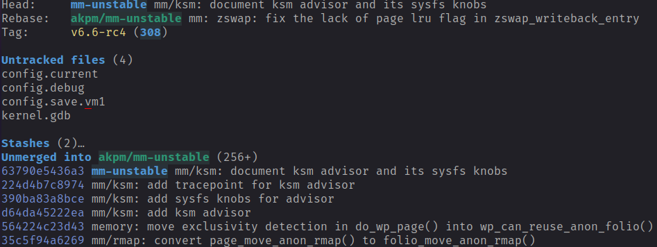
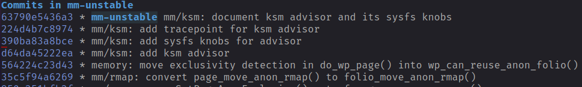
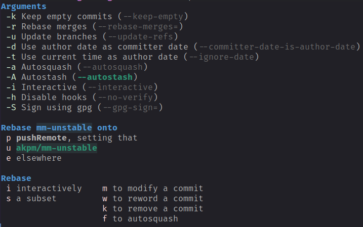
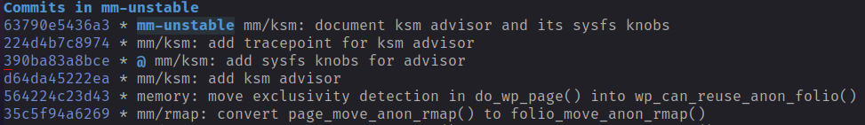
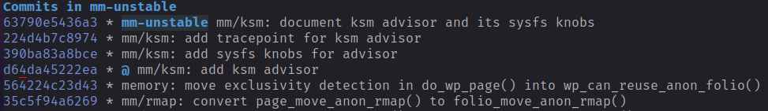
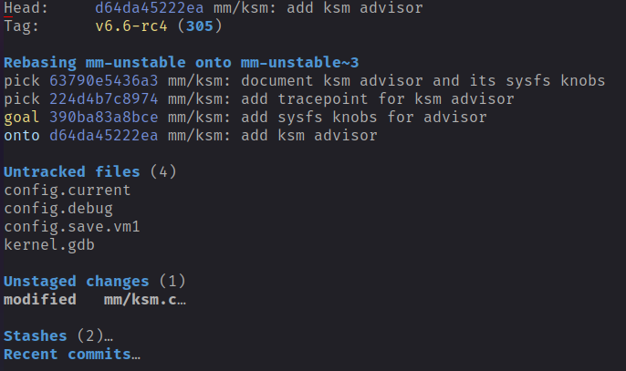
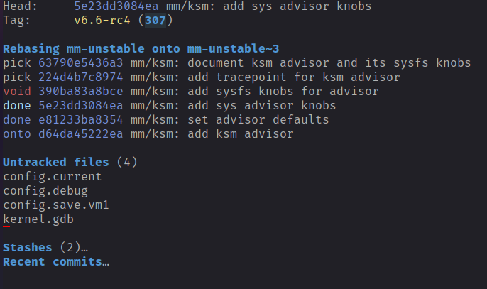
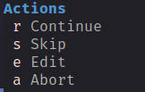
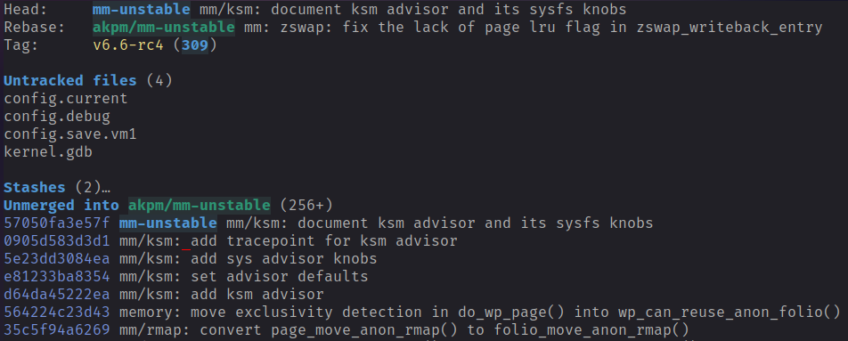

This article describes how to split an earlier commit into several commits
with Magit and Doom Emacs".
<!--more-->

## Overview
When doing kernel development it is not uncommon that code reviewers ask you to split a
commit into several commits. This can make sense so that each commit consists of one
logical change.

## Process
If your changes only consist of one commit, then this can be easily done by just doing a
soft reset to the previous commit. The changes of the commit will be in the unstaged area
and can then be easily split over several commits.
If however the commit to be split is part of a patch series, then the process is more
complicated. The following description shows how to approach this with Magit and Doom Emacs.

## Splitting a commit of a patch series
The first step is to open Magit status window. The status window shows several commits.
The last four commits are all part of a patch series and the goal is to split the second commit
with hash 390ba83a8bce into two commits.

 

The log window can be displayed by pressing `l l`.

 

Move the cursor to the commit that we want to split. This is the third line.
Then press the `r` key to open the rebase popup.

 

Select `m` to modify the commit the cursor is positioned at. You can notice how the `@`
sign is moved to the commit that we want to split. This means that HEAD is now pointing
to that commit.

 

We want to move HEAD to the parent of this commit: this is the line below. So we move
the cursor to the line below. We want to reset to the point. This can be achieved by
calling the function `magit-reset-quickly` or with the keybinding `o` (Keep in mind this
keybinding is Doom Emacs specific). Your Magit log window should now look like:

 

The Magit log window can now be closed by pressing the `q` key. This will close the Magit
log window and the Magit status window will be displayed.

 

The above display shows that we are in a rebase and our second window has been unstaged.
We can not split and stage the change as required. Just select the hunks as required and
split in as many commits as needed. For this example I have split the second commit in
two commits.

 

The above status window shows the display after the two commits have been created. Now the
rebase can be continued by opening the rebase menu. The rebase menu can be opened by
pressing the `r` key.

 

To complete the rebase, just press `r` again. The rebase menu will close and the Magit status
window now contains all 5 commits.

 

